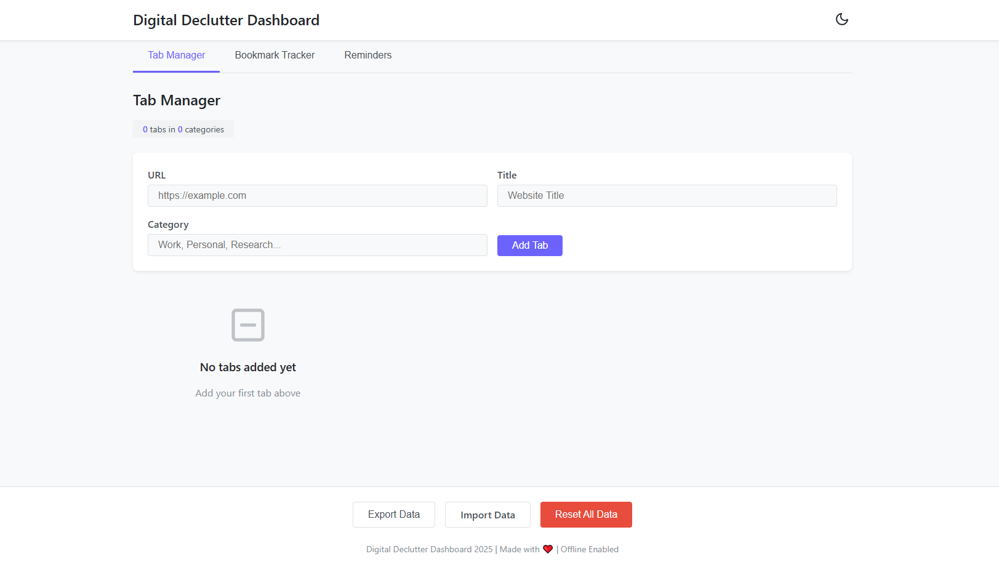

# Digital Declutter Dashboard

**Digital Declutter Dashboard** is a web application designed to help you organize and manage your browser tabs, bookmarks, and digital reminders. With a clean interface and offline support, it empowers users to take control of digital clutter and boost productivity.

## Features

- **Tab Manager:** Add, categorize, and track your open browser tabs.
- **Bookmark Tracker:** Inventory your bookmark folders with counts and descriptions.
- **Declutter Reminders:** Set and track reminders for digital cleanup tasks.
- **Theme Toggle:** Switch between light and dark mode.
- **Data Export/Import:** Backup or restore your dashboard data as a JSON file.
- **Offline Support:** Works offline as a Progressive Web App (PWA).

## Screenshots



## Getting Started

1. **Clone or Download the Repository**
   ```
   git clone https://github.com/your-username/digital-declutter-dashboard.git
   ```
2. **Open `index.html` in your browser**  
   No build steps required—just open the file to start using the dashboard.

3. **(Optional) Install as a PWA**  
   Add the app to your device’s home screen for a native-like experience.

## Project Structure

- `index.html` – Main application UI
- `style.css` – Stylesheet
- `app.js` – Application logic
- `manifest.json` – PWA manifest
- `service-worker.js` – Service worker for offline support

## License

See [LICENSE](LICENSE) for details.

---

*Replace screenshot and repository links as needed.*